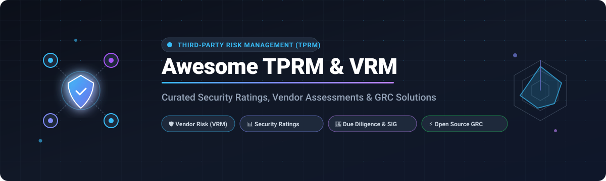

# 🛡️ Awesome Third-Party Risk Management (TPRM)

<p align="center">
  <a href="https://github.com/ishandutta2007/Awesome-Awesome-Awesome"></a>
  <a href="https://discord.gg/jc4xtF58Ve"></a>
  <a href="https://github.com/ishandutta2007/Awesome-Third-Party-Risk-Management/stargazers"></a>
  <a href="https://github.com/ishandutta2007/Awesome-Third-Party-Risk-Management/network/members"></a>
  <a href="https://github.com/ishandutta2007/Awesome-Third-Party-Risk-Management/issues"></a>
  <a href="https://github.com/ishandutta2007/Awesome-Third-Party-Risk-Management/blob/main/LICENSE"></a>
  <a href="https://github.com/ishandutta2007"></a>
</p>

<p align="center">
  
</p>

<p align="center">
  <strong>Curated list of SaaS Platforms &amp; Open-Source GitHub Projects for Third-Party Risk Management (TPRM), Vendor Risk Management (VRM), Security Ratings, Due Diligence Questionnaires (SIG/CAIQ), and Continuous External Cyber Attack-Surface Monitoring.</strong>
</p>

---

## 🧭 Overview & Ecosystem Highlights

Third-Party Risk Management (TPRM) and Vendor Risk Management (VRM) platforms enable security, compliance, and procurement teams to discover supply-chain risk, automate security assessment questionnaires (NIST SP 800-161, ISO 27001, SOC 2, DORA, GDPR), monitor external attack surfaces, quantify cyber liability (FAIR), and manage the complete vendor risk lifecycle.

### 📊 Market Size & Industry Structure
> 💡 **Market Dynamics**: The global Third-Party Risk Management (TPRM) market is valued at **~$8.5B–$10.2B in 2025–2026** and expanding at a Compound Annual Growth Rate (**CAGR of ~14.5%–16.0%**), driven by escalating supply chain breaches, NIS2, DORA, and tightening global compliance mandates. The sector is **moderately to highly fragmented** rather than a winner-take-all monopoly—dominated by specialized security rating networks (BitSight, SecurityScorecard), large-scale GRC/privacy suites (OneTrust), lifecycle workflow engines (ProcessUnity, Prevalent), and emerging AI-native automated due-diligence platforms.

---

## 📑 Table of Contents

- [🏢 SaaS & Hosted Platforms](#-saashosted-platforms)
- [💻 Open-Source GitHub Projects](#-open-source-github-projects)
- [🧩 Architecture Patterns for Custom TPRM Stacks](#-architecture-patterns-for-custom-tprm-stacks)
- [📈 Star History](#-star-history)
- [🤝 How to Contribute](#-how-to-contribute)
- [⚠️ Disclaimer](#-disclaimer)

---

## 🏢 SaaS/Hosted Platforms

*Ranked in descending order of enterprise scale (valuation, estimated ARR / revenue, and market capitalization).*

| Platform | Company Size (Valuation / Revenue) | Description | Starting Price | Free Tier / Free Trial Limits |
| :--- | :--- | :--- | :--- | :--- |
| **[OneTrust](https://www.onetrust.com/)** | **$4.5B Valuation**<br>~$550M ARR (Funding: $1.13B) | Comprehensive enterprise GRC, trust, and privacy platform with dedicated Third-Party Risk modules, automated assessments, and vendor workflows. | Starts at ~$10,000/year (~$11,500/year median spend; modular pricing scaled by admin users and vendor volume) | No full platform free trial/tier (demo only); Free standalone compliance tools available (e.g., cookie banner gallery, CCPA opt-out builder). |
| **[BitSight](https://www.bitsight.com/)** | **$2.4B Valuation**<br>~$200M+ ARR (Funding: $398M) | Leading security ratings and external continuous monitoring provider, widely adopted across financial services, cyber insurance, and global enterprises. | Starts at ~$23,000–$25,000/year (Contract-based pricing scaling with entity count, typically 1–50 vendors in entry tier) | No free trial of core platform; Free forever Trust Management Hub (TMH) account for managing/sharing security questionnaires + complimentary one-time Cyber Risk Report. |
| **[SecurityScorecard](https://securityscorecard.com/)** | **$1.0B+ Valuation**<br>~$130M–$140M ARR (Funding: $292M+) | Security ratings and supply chain continuous monitoring platform offering objective cyber posture visibility and vendor intelligence. | Starts at ~$13,500/year (Business Tier covering 5 domains on AWS Marketplace; Enterprise tiers scale to $25,000–$155,000+/year) | Free-forever plan for self-monitoring own domain & responding to questionnaires; 14-day free trial for Business tier (monitors up to 5 third-party companies). |
| **[ProcessUnity](https://www.processunity.com/)** | **Acquired by Marlin Equity**<br>~$50M–$80M Est. Revenue | Configurable enterprise third-party risk management and vendor lifecycle automation platform tailored for highly regulated enterprises. | Starts at ~$25,000/year (Custom quote based on modules and vendor count) | No general free trial/tier; Free access only to DDQ AutoAssist on Global Risk Exchange for third parties to draft questionnaire responses. |
| **[Venminder](https://www.venminder.com/)** | **Acquired by Ncontracts**<br>~$35.8M Revenue (Funding: $57.6M) | End-to-end vendor risk management suite providing software and managed due-diligence review services for banking and financial institutions. | Starts at ~$15,000–$25,000/year (Software tiers scale up to $125,000+/year based on vendor assessments and Venmonitor feeds) | Free forever account for the Venminder Exchange directory (search & purchase individual control assessments); Software platform is demo-only with no general free trial/tier. |
| **[Panorays](https://panorays.com/)** | **~$25.9M Revenue**<br>Total Funding: $62M | Hybrid third-party cybersecurity platform combining automated smart questionnaires with external attack-surface posture scans. | Starts at ~$30,000/year (Deployments scale up to $150,000+/year based on vendor volume and assessment frequency) | Free Starter Plan / Trust Center forever (monitor own posture + up to 5 third-party vendors & basic questionnaire templates); 14-day free trial for advanced platform capabilities (no credit card required). |
| **[Black Kite](https://blackkite.com/)** | **~$25.0M Revenue**<br>Total Funding: $36M | Continuous cyber risk rating and intelligence platform delivering ransomware susceptibility, FAIR risk quantification, and compliance ratings. | Starts at ~$15,000–$20,000/year (Annual subscription scaled by number of monitored vendors and modules: Monitor, Assess, Extend) | No free tier or self-service free trial; interactive/guided proof-of-concept demo available upon request. |
| **[Prevalent](https://www.prevalent.net/)** | **Acquired by Mitratech**<br>~$20M–$30M Est. Revenue | Enterprise third-party risk management and risk network platform featuring compliance mapping, contract intelligence, and monitoring. | Starts at ~$15,000/year (Enterprise contracts scale to $50,000–$200,000+ based on vendor volume and managed services) | No free tier or standard self-service free trial; guided pilot/demo available upon request. |
| **[UpGuard](https://www.upguard.com/)** | **Scale-up Growth**<br>Total Funding: $121M (Series C $75M) | Transparent third-party vendor risk and external attack-surface monitoring platform with security ratings and questionnaire automation. | Starts at $1,750/month ($21,000/year billed annually; additional vendors at ~$79/month each) | Free forever plan allowing monitoring of up to 5 vendors + Trust Exchange AI questionnaire tools; 14-day full feature free trial. |
| **[Whistic](https://www.whistic.com/)** | **~$11.5M Revenue**<br>Total Funding: $51.1M–$71M | Vendor assessment exchange and AI trust center platform enabling buyers and vendors to exchange proactive security documentation. | Starts at ~$12,700–$20,625/year (Average annual spend; tiered based on Core/Pro/Enterprise and assessment volume) | Free Basic Profile forever for vendors to publish & share trust documentation; 30-day free trial for Compliance Automation module. |

---

## 💻 Open-Source GitHub Projects

*Open-source platforms, GRC engines, vulnerability aggregators, and compliance automation frameworks sorted in descending order of community GitHub stars.*

1. **[Trivy](https://github.com/aquasecurity/trivy)** [](https://github.com/aquasecurity/trivy/stargazers)  
   Comprehensive security and dependency scanner for container images, file systems, Git repositories, virtual machine images, and software supply chain components (SBOM, CVEs, misconfigurations). Crucial for auditing third-party open-source software risk.

2. **[Nuclei](https://github.com/projectdiscovery/nuclei)** [](https://github.com/projectdiscovery/nuclei/stargazers)  
   Fast and customizable vulnerability scanner based on simple YAML-based DSL templates. Widely used for continuous external attack-surface scanning and assessing perimeter vulnerabilities across third-party vendor infrastructures.

3. **[Osquery](https://github.com/osquery/osquery)** [](https://github.com/osquery/osquery/stargazers)  
   SQL-powered operating system instrumentation, monitoring, and analytics framework used to query endpoints and verify compliance controls across contractor and third-party managed fleets.

4. **[OpenCTI](https://github.com/OpenCTI-Platform/opencti)** [](https://github.com/OpenCTI-Platform/opencti/stargazers)  
   Open Cyber Threat Intelligence platform developed by Filigran to organize, store, correlate, and operationalize cyber threat intelligence feeds and supply-chain threat actor profiles.

5. **[DefectDojo](https://github.com/DefectDojo/django-DefectDojo)** [](https://github.com/DefectDojo/django-DefectDojo/stargazers)  
   Open-source vulnerability management and DevSecOps orchestration tool used to consolidate third-party vendor vulnerability scans, SBOMs, and penetration test findings in a single pane of glass.

6. **[CISO Assistant](https://github.com/intuitem/ciso-assistant-community)** [](https://github.com/intuitem/ciso-assistant-community/stargazers)  
   Modern, fast, and multi-standard open-source GRC platform covering compliance framework mapping (ISO 27001, NIST CSF, SOC 2, DORA, NIS2), risk assessments, and vendor risk tracking workflows.

7. **[OWASP Threat Dragon](https://github.com/OWASP/threat-dragon)** [](https://github.com/OWASP/threat-dragon/stargazers)  
   Open-source threat modeling tool used for creating threat model diagrams and identifying supply-chain, data-flow, and architectural risks associated with third-party service integrations.

8. **[Openlane](https://github.com/theopenlane/core)** [](https://github.com/theopenlane/core/stargazers)  
   Open-source trust management and compliance automation platform that includes entity registries, vendor management records, audit readiness, and customizable questionnaires.

9. **[Eramba](https://github.com/eramba)** [](https://github.com/eramba/eramba_v2/stargazers)  
   Dedicated enterprise open-source Governance, Risk, and Compliance (GRC) software suite facilitating vendor risk registers, control audits, compliance assessments, and third-party contract reviews.

10. **[OpenThreatModel (OTM)](https://github.com/iriusrisk/OpenThreatModel)** [](https://github.com/iriusrisk/OpenThreatModel/stargazers)  
    Open, tool-agnostic standard representation (YAML/JSON format) for defining threat models, vendor asset boundaries, trust zones, and supply chain data flows.

11. **[LT-VRM (LearnTPRM)](https://github.com/learntprm-design/lt-vrm)** [](https://github.com/learntprm-design/lt-vrm/stargazers)  
    Open-source dedicated TPRM & Vendor Risk Management platform supporting vendor onboarding, custom security questionnaires, 0–1000 risk scoring, contract management, breach monitoring, and a dedicated vendor portal.

12. **[VendorAuditAI](https://github.com/MikeDominic92/VendorAuditAI)** [](https://github.com/MikeDominic92/VendorAuditAI/stargazers)  
    Autonomous AI agent platform built to accelerate vendor security audits, extract evidence from SOC 2 reports, and map vendor postures to NIST and ISO controls.

13. **[Fair TPRM](https://www.fairtprm.com/)** [](https://www.fairtprm.com/)  
    Open-source Third-Party Risk Management platform that blends vendor inventory tracking, compliance checklists (ISO, NIST, SOC 2), and FAIR (Factor Analysis of Information Risk) financial loss quantification.

14. **[Bandit – Vendor Privacy Risk Assessment](https://github.com/conorrusso/bandit)** [](https://github.com/conorrusso/bandit/stargazers)  
    AI-assisted command-line scanner that scores third-party vendor privacy policies against GDPR, CCPA, and CPRA standards.

15. **[RiskHub](https://github.com/W1z4rd1c4/RiskHub)** [](https://github.com/W1z4rd1c4/RiskHub/stargazers)  
    Lightweight open-source risk operations repository for tracking enterprise KRIs, governed risks, vendor assessments, and evidence files.

16. **[StreamSafe-TPRM](https://github.com/JohnIdogo/StreamSafe-TPRM)** [](https://github.com/JohnIdogo/StreamSafe-TPRM/stargazers)  
    End-to-end framework repository modeling vendor tiering, risk matrices, and security questionnaire scoring workflows.

---

## 🧩 Architecture Patterns for Custom TPRM Stacks

Organizations seeking full data sovereignty and zero licensing fees can combine these open-source tools into an end-to-end TPRM workflow:

```
                                  ┌───────────────────────────────┐
                                  │   Vendor Onboarding Intake    │
                                  │ (Openlane / LT-VRM Registry)  │
                                  └──────────────┬────────────────┘
                                                 │
                  ┌──────────────────────────────┴──────────────────────────────┐
                  ▼                                                             ▼
  ┌───────────────────────────────┐                             ┌───────────────────────────────┐
  │  Internal Control Assessment  │                             │   External Attack Surface     │
  │ (CISO Assistant / Eramba GRC) │                             │   (Nuclei / Trivy Scanning)   │
  └──────────────┬────────────────┘                             └──────────────┬────────────────┘
                 │                                                             │
                 └──────────────────────────────┬──────────────────────────────┘
                                                ▼
                                  ┌───────────────────────────────┐
                                  │ Unified Risk & Threat Correl. │
                                  │   (DefectDojo & OpenCTI)      │
                                  └──────────────┬────────────────┘
                                                 ▼
                                  ┌───────────────────────────────┐
                                  │   Continuous Risk Dashboard   │
                                  │ (FAIR TPRM / Metabase / BI)   │
                                  └───────────────────────────────┘
```

- **Core Inventory & Portal**: Use **LT-VRM** or **Openlane** as the primary vendor database and intake workflow.
- **Questionnaires & GRC**: Leverage **CISO Assistant** or **Eramba** to manage assessments mapped to ISO 27001, NIST CSF, and SOC 2.
- **External Scanning & SBOM**: Integrate **Nuclei** for perimeter scanning and **Trivy** for vendor software artifact SBOM analysis.
- **Findings Aggregation**: Ingest scanner outputs and vendor issues into **DefectDojo** to track remediations with automatic ticketing triggers.

---

## 📈 Star History

[](https://star-history.dera.page/#ishandutta2007/Awesome-Third-Party-Risk-Management&type=date&legend=top-left)

---

## 🤝 How to Contribute

We welcome community contributions! To add a new platform, tool, or resource:

1. 🍴 **Fork** this repository.
2. 📝 **Add or update** entries in `README.md` following the table or list schema.
3. 🔎 **Verify details**: Include accurate names, official links, pricing, free tier / trial terms, and open-source star badges.
4. 🚀 **Submit a Pull Request** with a descriptive summary of your addition.

---

## ⚠️ Disclaimer

- This list is **community-curated** for educational, architectural, and evaluation purposes; inclusion does not constitute a commercial endorsement.
- Third-party risk management involves legal, regulatory, and compliance mandates (e.g., DORA, NIS2, GDPR, HIPAA, SOC 2). Always validate that your vendor risk assessment processes comply with relevant industry standards and local regulatory guidelines.

---

<p align="center">
  <sub>Maintained with ❤️ by the security and GRC community. Star ⭐ this repository if you find it helpful!</sub>
</p>

